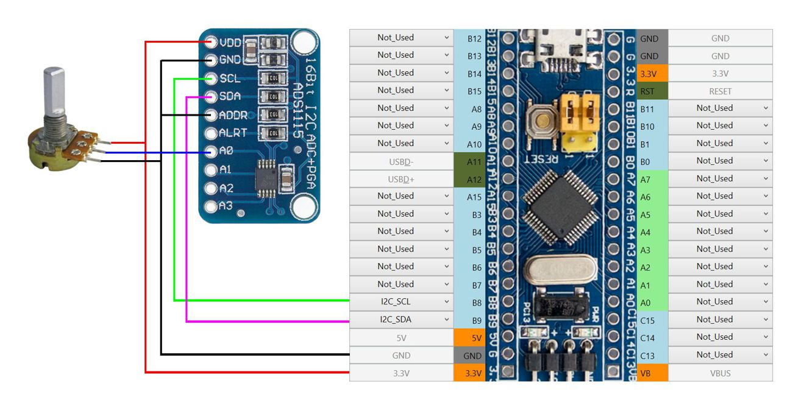

ADS1115 is a four-channel analog-to-digital converter (ADC). It operates on the I2C interface.

 
* I2C_SCL - Common for all I2C devices (AS5600 and ADS1115 ADCs)
* I2C_SDA - Common for all I2C devices (AS5600 and ADS1115 ADCs)

As wshown on the picture above, the ADC can be bought already mounted on the board. Up to four ADS1115 can be connected to the controller (keep in mind that the total number of axes must not exceed eight). To do this, you need to set different addresses for the devices. This is done by connecting the ADDR pin to the other pins on the board. There are 4 addresses available:

The addresses assigned to the ADC boards must be remembered because they will be used in adjusting the axes.

[Potentiometers] (Potentiometer-connection.md), [Hall sensors] (Hall-sensors-connection.md) or any other type of analog with output signal range from 0 to 3.3V can be used as sources of signal for external ADC.

The ADC can be used to connect analog sensors if it is necessary to reduce the number of conductors for their connection (for example inside of the stick) or to reduce the influence of EMI on long conductors (in this case place the ADC near to the sources of the analog signal). ADS1115 use slow I2C interface which means that adding each new sensor to the configuration increases the processing time of all signals therefore it is necessary to use ADS1115 carefully.

The subsequent axis settings are described in the [Axis Settings] section (Axis-configuration.md)