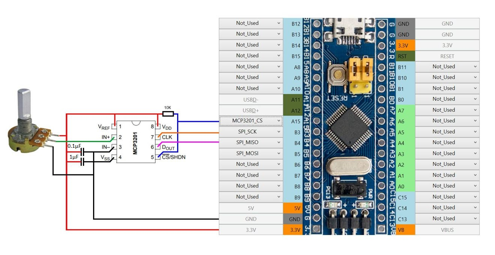
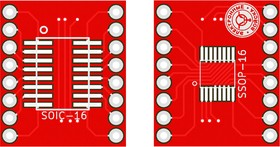

MCP32XX is a family of analog-to-digital converters (ADCs). The last digit in the name indicates the number of analog channels that can be connected to the ADC. There are available one-, two-, four- and eight-channel modifications. It operates on the SPI interface.

 
SPI_SCK - Common for all SPI devices (TLE5011, MLX90393, MCP32XX and all shift register chains);
SPI_MISO - data input, common to all SPI devices;
SPI_MOSI - common to all SPI devices;
MCP320x_CS - individual for each ADC.

Other modifications of the ADC are connected in the same way. The pinout of the various modifications of the MCP32XX is shown below:

We have never seen MCP32XX chips to be in sale already mounted to pcb, so we recommend either manufacturing the board yourself.

Or you can use a riser, such as this one for the MCP3201 and MCP3202:

or such for MCP3204 and MCP3208:

These ADC available in different cases: DIP-8, DIP-16 - for mounting in holes, SO-8, SO-16 for surface mounting on a board. The risers shown above are designed for ADCs in SO-8, SO-16 packages.

[Potentiometers](Potentiometer-connection.md), [Hall sensors](Hall-sensors-connection.md) or any other type of analog with output signal range from 0 to 3.3V can be used as sources of signal for external ADC.

The ADC can be used to connect analog sensors if it is necessary to reduce the number of conductors for their connection (for example inside of the stick) or to reduce the influence of EMI on long conductors (in this case place the ADC near to the sources of the analog signal).

The subsequent axis settings are described in the [Axis Settings] section (Axis-configuration.md)