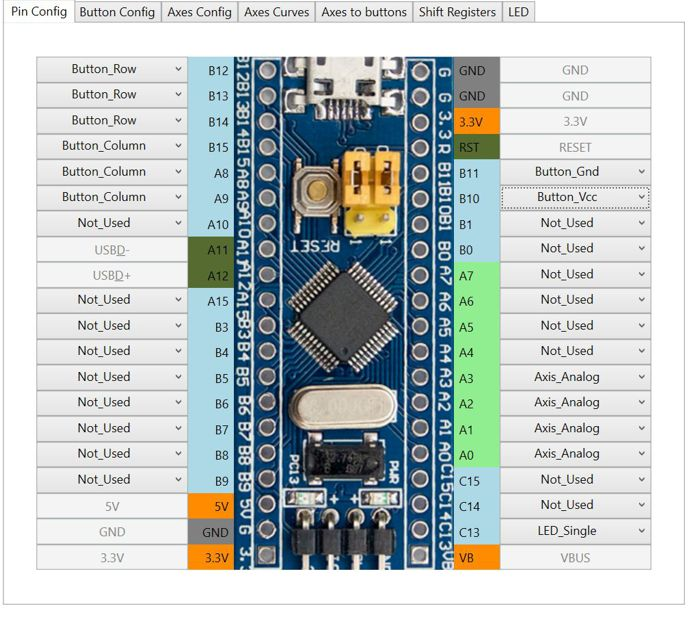

[Start page](../README.md) | [Previous level](Buttons-connection.md)

### 1. An example of connecting buttons in the figure below:

Any diodes can be used, for example 1N4148.

### 2. Assignment of controller contacts (Pin Config tab):

Without using shift registers buttons can be connected in three different ways:

Single buttons (the number of buttons assigned in this way is displayed in the Single Buttons line of the Current Config field on the right side of the configurator):
* Button_Gnd - a button connects this contact to 0 (contacts with 0 power are marked “G”)
* Button_Vcc - a button connects this contact to the power contact (power contacts are marked “3.3”)

Using a matrix of buttons, where:

* Button_Row and Button_Column - rows and columns of the matrix, respectively. The number of rows and columns of the matrix is ​​listed in the Rows of buttons and Columns of buttons rows of the Current Config field on the right side of the configurator. In this case, the number of matrix buttons can be calculated by multiplying the number of rows and columns.

[Start page](../README.md) | [Previous level](Buttons-connection.md)

