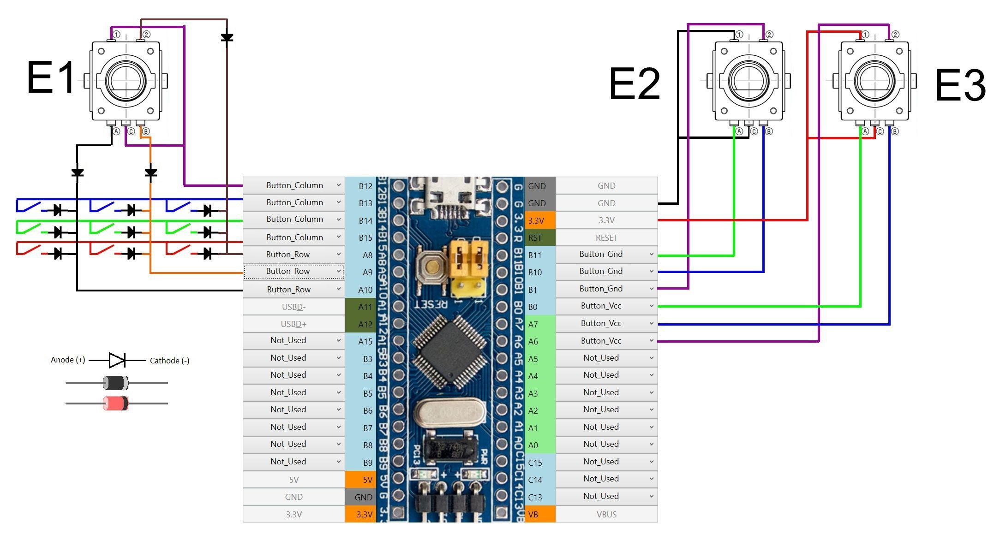

# Encoders connection:

Incremental encoders, such as the PEC11R encoder, can be connected to FreeJoy. Encoders of this production line differ in resolutions (12, 18, 24 pulses per revolution) can be produced with clicks (tactile change in the rotation force of the knob) and without them and can have either do not have a button to press.

The options for connecting an encoder with a button are shown in the figure below:

Here, the E1 encoder is connected to the button matrix, the E2 and E3 encoders use the low (Button_Gnd) and high (Button_Vcc) voltage levels as the signal type respectively. Also encoders can be connected to [shift registers] (Connecting-buttons-to-shift-registers.md).

Assignation:
* Logical button 1 - physical 1 (type Encoder_А) (Encoder channel A).
* Logical button 2 - physical 2 (type Encoder_B) (Encoder channel B).
* Logical button 3 - physical 3 (Button_Normal) (Encoder button).

Next, you need to check the operation of the encoder on the same tab of the configurator. When the encoder rotates in one direction, button 1 is pressed, when encoder rotates in other direction button 2 is pressed. Pressing on the encoder will trigger button 3. If necessary, adjust the [Encoder press time] (Advanced-settings.md). Recommended values are less than 50 ms. The default is 10 ms.

Further the encoders can be used as standalone buttons, or as a source for [converting button presses into axis movements] (Buttons-encoders-to-axis-function.md).
