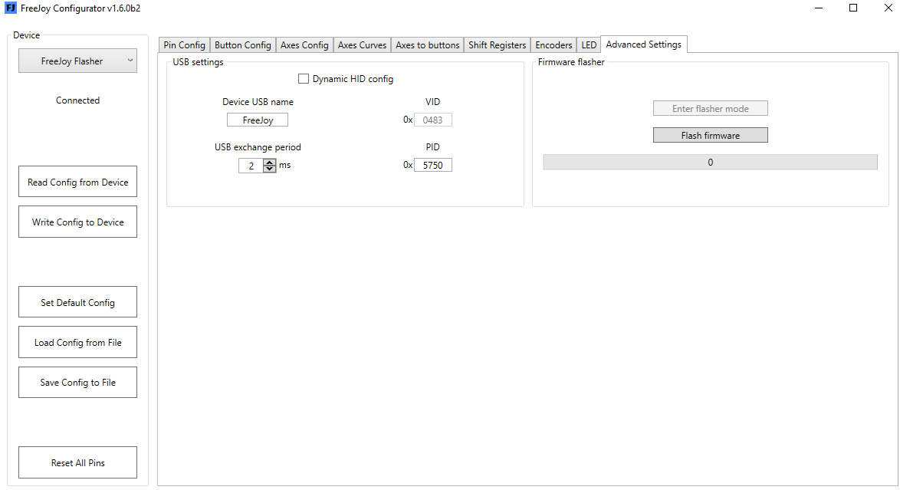
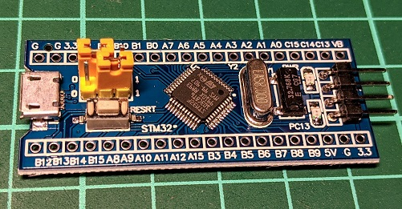

The firmware download function allows you to update the firmware of the device without a programmer. This function works if the controller has already been [flashed](Flashing-firmware.md) with FreeJoy firmware using the programmer. The function is available in the "Firmware flasher" field on "Advanced settings" tab:

;

For loading new firmware you need to set your device into bootloader mode (it should appear in system as "FreeJoy Flasher" and LED should blink). There are two ways to do this:

### Entering bootloader mode from configurator

* Connect your device via USB;
* Go to "Advanced settings" tab;
* Press "Enter flasher mode" button and wait until device reconnect as "FreeJoy Flasher" (it should take a few seconds)

### Entering bootloader mode by setting jumpers

If you cannot enter bootloader mode from configurator for some reason:

* Unplug your device from USB and other power sources;
* Set jumper BOOT1 (closest to the button on BluePill board) to position 1. It is important to keep BOOT0 in position 0:

* Plug your device to USB and make sure it is connected as "FreeJoy Flasher". 

### Loading firmware

* Make sure your device is in bootloader mode (LED is blinking and USB device is called "FreeJoy Flasher)
* Press the button "Flash firmware";
* Select a .bin file from the archive with the version you need [FreeJoy](https://github.com/vostrenkov/FreeJoy/releases);
* Press "Ok" and wait until the progress bar reaches 100%;
* If you entered into bootloader mode by setting jumper return all jumpers to position 0 and replug your device.

After that your controller will have a new firmware and you can begin to configure it.
