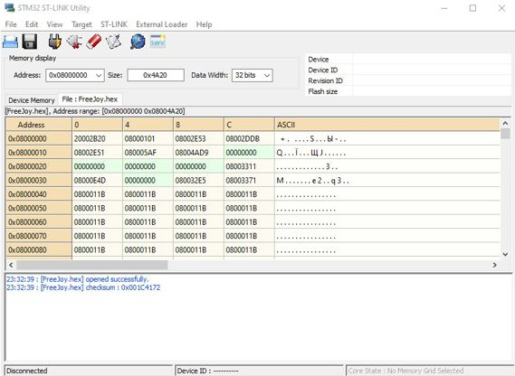
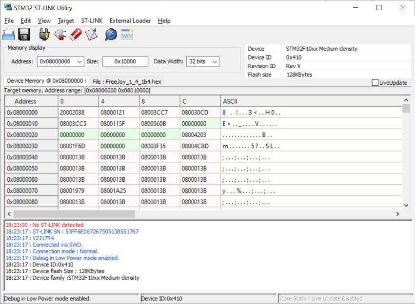
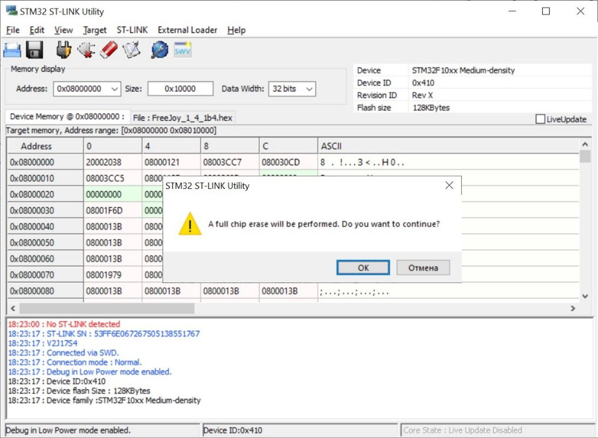
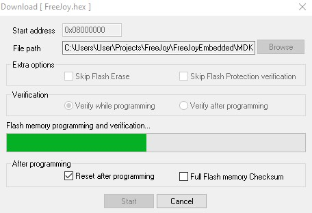

[Start page](../README.md) | [Previous level](Flashing-firmware.md)

1. Connect the programmer as shown in the figure below (check the signatures of the contacts on the programmer and controller board):

2. Connect the ST-Link v2 programmer to the computer;
3. Run the ST-Link program;
4. Click on "File-> Open File" in the program and select the .hex file which is located in the FreeJoy release archive;
5. Now you will see the binary code download page:

6. Click "Target-> Connect". After connecting the device, you can see such information as the device ID, the size of the flash memory and the device family in the block above and view the contents of the internal memory in the main block:

7. Click "Targert-> Erase chip" and "OK";

8. Now click "Target-> Program & Verify" and in the appeared window click "Start". Controller programming will start:

9. After successful programming of the controller, disconnect all connections and connect the controller board to the computer using a MicroUSB cable.
10. FreeJoy device is defined in the system as a game controller.

[Start page](../README.md) | [Previous level](Flashing-firmware.md)
