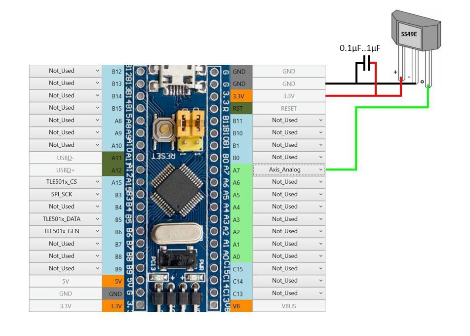
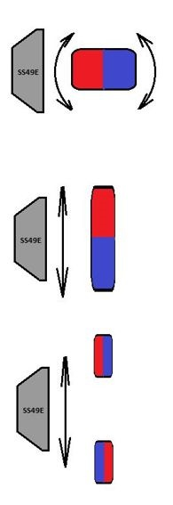

[Start page](../README.md) | [Previous level](Axes-connection.md)

Like the potentiometer the Hall sensor is an analog signal source. It can be connected either directly to the controller or via external ADCs (analog-to-digital converters) MSP32XX and ADS1115.

An example of connecting Hall sensor directly to the controller:

Hall sensor connection example:

The figure shows the connection of the Hall Sensor SS49E. It is recommended the blocking capacitor to be placed as close to the sensor as possible. The Hall sensor responds to a smooth pole change by changing the output voltage (O) like a potentiometer.

Possible location of the magnet relative to the Hall sensor:

Hall sensors are usually more expensive than potentiometers. They are recommended to be used to control those axes that are often used in simulators, but when high accuracy of data is not very important. The resource of Hall sensors is almost unlimited, because they are contactless, but the accuracy of their output may be low. The subsequent axis settings are described in the [Axis Settings] section (Axis-configuration.md)

[Start page](../README.md) | [Previous level](Axes-connection.md)

