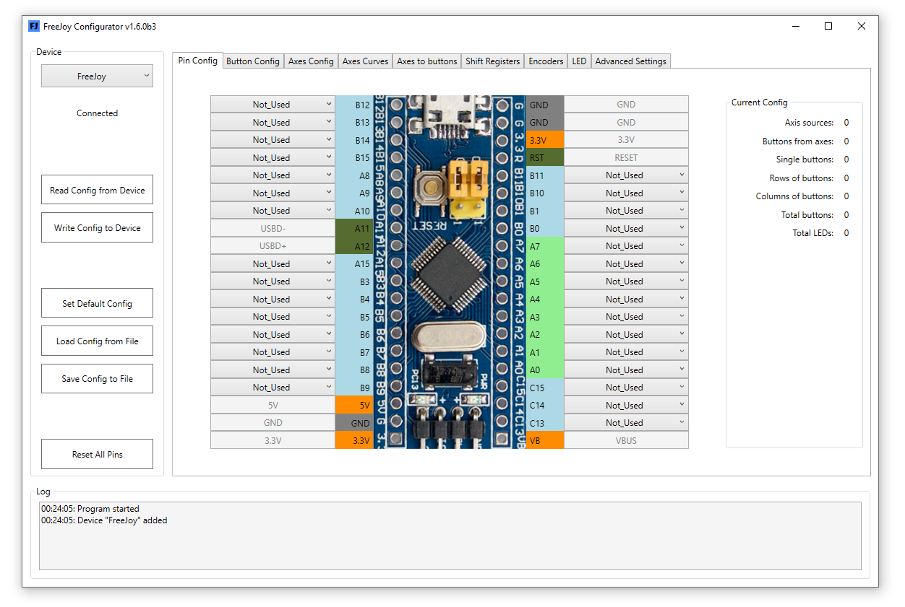

# FreeJoy

FreeJoy is a customizable gaming device controller based on the low-cost STM32F103C8 microcontroller. It allows you to create your own HOTAS-systems (sticks, throttles, various expansion panels), pedals, car control systems (steering wheels, pedals, gearbox shifters, etc.) and configure the designed device.

## Features:

* Up to 8 - analog axes (output resolution 12 bits);
* Up to 128 buttons or toggle switches;
* Up to 4 HAT switches;
* Up to 16 incremental encoders (1 high-resolution encoder);
* Ability to assign button presses to certain positions of the analog axis (up to 12 buttons per axis);
* Support for shift registers 74HC165 and CD4021 to increase the number of connected buttons;
* Support for digital Hall sensors TLE5010/TLE5011, AS5600, MLX90393 (only SPI interface);
* Support for external ADCs ADS1115 and MCP3201/02/04/08;
* 3 channels PWM for backlight control;
* 24 LEDs (single or in the matrix), mapped to the states of the buttons;
* Setting the device name and other USB parameters;
* Convenient utility for configuration;
* Upgrade firmware via USB;
* Save and load device configuration from file.

## Axes:

FreeJoy supports up to 8 axes. Analog inputs (potentiometers, hall sensors) on the A0-A7 terminals, digital sensors (TLE5010/5011, AS5600, MLX90393), or external ADCs (ADS1115 and MCP3201/02/04/08) can be used as sources for the axes. All axes have the following settings:

* Source/destination of the axis (X, Y, Z, Rx, Ry, Rz, Slider1, Slider2);
* Enable/disable axis output;
* Resolution;
* Calibration (manual / automatic);
* Smoothing (off or 7 levels of filter settings);
* Inversion;
* Dynamic or center deadband;
* Axis offset (magnet offset);
* Response curves;
* Axis from buttons/encoders;
* Trimming axis by buttons
* Axis prescaler
* Ability to generate button presses in certain axis positions (up to 12 sections).
* Combined axes functions

## Buttons:

FreeJoy supports up to 128 buttons connected as single buttons (shorting the signal contact to GND or VCC), as a matrix of buttons, via shift registers or through the axis-to-button function. Buttons can be configured as:

* Normal button;
* Inverted button;
* Toggle switch on/off;
* Toggle switch on;
* Toggle switch off;
* HAT switch;
* Input incremental encoder;
* Radiobutton;
* Sequential button;
* Sequential toggle button
* 5 shift modificators.

For setting up your device configurator utility is required. Download [latest release](https://github.com/FreeJoy-Team/FreeJoy/releases) and run the installer.
