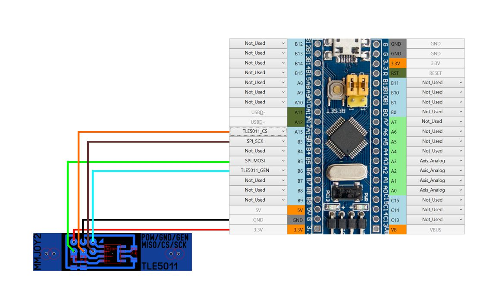
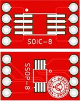
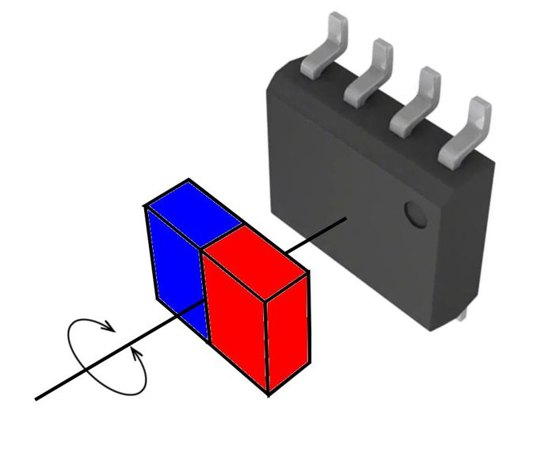

[Start page](../README.md) | [Previous level](Axes-connection.md)

TLE5011 and TLE5010 are single-channel digital Hall sensors. They operate on half-duplex SPI interface.

 
**Attention: The TLE501x data line should have one 1k pull-up resistor for correct operation**

* SPI_SCK - Common for all SPI devices (TLE5011, MLX90393, MCP32XX and all shift register chains);
* SPI_MOSI - common to all SPI devices;
* TLE5011_GEN - common to all TLE5011;
* TLE5011_CS - individual for each TLE5011.

The cost of the TLE5010 and TLE5011 sensors is comparable to the Hall sensors. They are recommended to be used to control the most important axes of the controller, which are often used in simulators and when the highest accuracy of readings is required. The resource of TLE sensors is almost unlimited as they are contactless like Hall sensors.

Already mounted boards with TLE5011 are rare therefore we recommend manufacturing the board yourself. The drawing of the TLE 5011 board for Sprint Layout can be taken [here](../ 3rd-party / hardware /)

Or you can use a riser, for example this:

The TLE5011/5010 sensors respond to a change in the direction of the axis of the magnetic field relative to the axis of the sensor. To do this, you can use rectangular (as in the figure), cubic magnets. Disc-shaped magnets and ring-shaped magnets can be used to ensure that they have ** diametral ** magnetization.

The subsequent axis settings are described in the [Axis Settings] section (Axis-configuration.md)

[Start page](../README.md) | [Previous level](Axes-connection.md)

