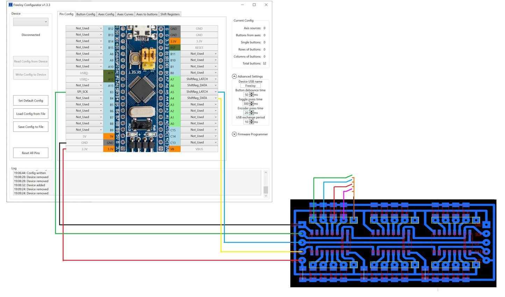

# Подключение кнопок к сдвиговым регистрам на примере сдвигового регистра 74HC165
## Проводка, назначение контактов:

Пример подключения платы сдвиговых регистров изображен ниже:

* SPI_SCK – Общий для всех TLE5011 и всех цепочек сдвиговых регистров.
* ShiftReg_LATCH, ShiftReg_DATA – индивидуальные для каждой цепочки сдвиговых регистров (Здесь к контактам A7, A6 подключена вторая цепочка сдвиговых регистров)
Питание сдвиговых регистров рекомендуется подключать от +3,3В.

## Назначение количества сдвиговых регистров.

Здесь к контактам А4, А5 подключено 3 сдвиговых регистра, к контактам А6, А7 – один. Задаем количество физических кнопок (количество сдвиговых регистров *8). PullUp и PullDown – тип подключения кнопок к сдвиговому регистру. Если у вас подтяжка входных контактов сдвигового регистра резистором к питанию, а сигнал нажатия кнопки – 0 на входном контакте выбираем тип подключения PullUp. Если все наоборот, то PullDown. Т.е. если вы подключили сдвиговый регистр и все кнопки в нажатом состоянии на вкладке Button Config. При замыкании кнопка из нажатого состояние переходит в не нажатое, то необходимо поменять тип с PullUp на PullDown (или наоборот).

Возможно подключение сдвиговых регистров 74HC165 и CD4021.  Обе микросхемы выпускаются как в корпусе DIP-16 (для монтажа в отверстия платы), так и в корпусе SO-16 (для накладного монтажа на плату) Чертежи платы для сдвиговых регистров 74HC165 в корпусе SO-16, как в примере приведенном выше, для Sprint Layout можно взять [здесь](../3rd-party/hardware/). Так же (если у вас нет возможности изготовить плату самостоятельно), можно воспользоваться переходной платой, например, такой:

К сдвиговым регистрам допускается подключать все виды переключателей (кнопки, тумблеры, энкодеры и т.д.). Их настройка аналогична [подключению кнопок непосредственно к контроллеру](Подключение-кнопок-непосредственно-к-контроллеру.md)
