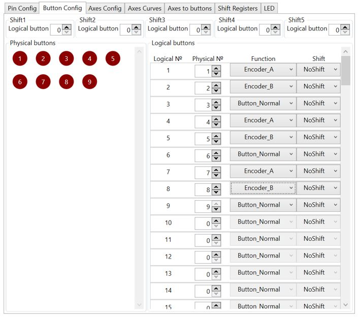

# Подключение энкодеров:

К FreeJoy возможно подключение инкрементнальных энкодеров, например энкодеров линейки PEC11R.  Энкодеры этой линейки отличаются различным разрешением (12, 18, 14 нажатий за оборот) могут выпускаться со щелчками (тактильное изменение  усилия вращения рукоятки при прохождении нажатий) и без них, бывают с разной формой штока (с лыской или шлицами), и могут иметь или не иметь кнопки на нажатие штока.

Варианты подключения экодера с кнопкой нажатия штока изображены на рисунке ниже :

Здесь энкодер Е1 подключен к матрице кнопок, энкодеры Е2 и Е3 в качестве типа сигнала используют низкий(Button_Gnd) и высокий (Button_Vcc) уровни напряжения соответственно. Так же энкодеры можно подключать к [сдвиговым регистрам](Подключение-кнопок-к-сдвиговым-регистрам.md).

Назначаем:
* Логической кнопке 1 – физическую 1 (тип Encoder_А) (Канал энкодера А).
* Логической кнопке 2 – физическую 2 (тип Encoder_B) (Канал энкодера B).
* Логической кнопке 3 – физическую 3 (Button_Normal) (Кнопка энкодера).

Далее необходимо проверить работу энкодера на этой же вкладке конфигуратора. При вращении энкодера в одну сторону будет нажиматься кнопка 1, в другую – кнопка 2. При нажатии на энкодер будет срабатывать кнопка 3. При неоходимости откорректировать значение [Encoder press time](Продвинутые-настройки.md) рекомендуемые значения – не более 50 мс. По умолчанию установлено 10 мс.

Далее энкодеры можно использовать как самостоятельные кнопки, либо как источник при [преобразовании нажатия кнопок в движение осей](Преобразование-нажатия-кнопок-в-движение-осей.md).